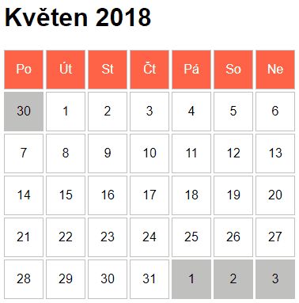

# Cvičení: CSS grid kalendář

## Zadání

Uprav CSS tak, aby výsledek vypadal jako na obrázku níže.


### Bonus

- Udělej v HTML z květnových dnů tlačítka.

  ```diff
  -<li>1</li>
  -<li>2</li>
  +<li><button>1</button></li>
  +<li><button>2</button></li>
  ⁝
  -<li>31</li>
  +<li><button>31</button</li>
  ```

- Nastyluj tlačítka tak, aby jednotlivé dny vypadaly stejně jako v původní variantě. Zachovej tedy bílou barvu pozadí i velikost čísel.

- Po najetí myši zatmav pozadí tlačítka na barvu `#ececec`.

#### Výsledek s bonusy


